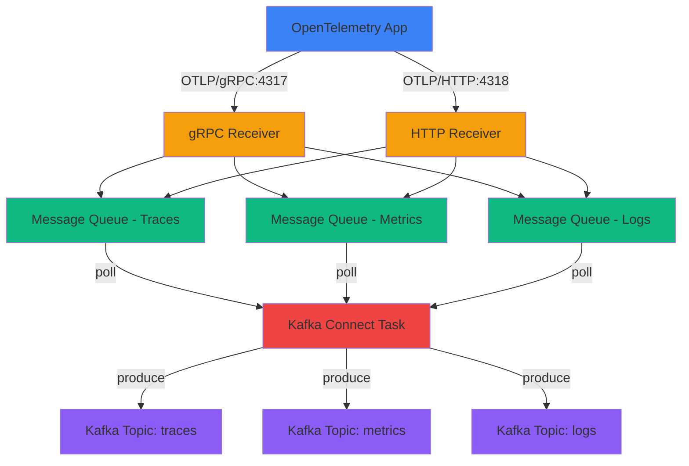

# Getting Started

This guide will help you install, configure, and deploy your first Kafka Connect OpenTelemetry connector.

## Overview

The Kafka Connect OpenTelemetry Source Connector enables you to receive telemetry data from any OpenTelemetry-instrumented application and stream it directly into Apache Kafka topics. It acts as an OTLP receiver endpoint, supporting both gRPC and HTTP protocols, and automatically routes traces, metrics, and logs to separate topics.

## What You'll Learn

In this section, you'll learn how to:

1. **[Prerequisites](prerequisites.md)** - Verify your environment has the required dependencies
2. **Installation** - Install the connector in your Kafka Connect cluster (see main README)
3. **[Configuration](configuration.md)** - Configure the connector for your use case
4. **Quick Start** - Deploy your first connector and verify it's working (see main README)

## Deployment Options

Choose the deployment method that best fits your environment:

### Distributed Mode (Production)

**Best for:**
- Production deployments
- High availability requirements
- Multiple connectors
- Horizontal scaling

**Configuration:**
```properties
# config/connect-distributed.properties
plugin.path=/usr/local/share/kafka/plugins
```

### Standalone Mode (Development)

**Best for:**
- Local development
- Testing
- Single connector instances
- Quick prototyping

**Configuration:**
```properties
# config/connect-standalone.properties
plugin.path=/usr/local/share/kafka/plugins
```

## System Requirements

### Minimum Requirements

- **Java**: 11 or higher
- **Kafka**: 3.9.0 or higher
- **Memory**: 1 GB RAM for connector
- **Network**: Ability to bind to ports 4317 (gRPC) and 4318 (HTTP)

### Recommended for Production

- **Java**: 17 (LTS)
- **Kafka**: Latest stable version
- **Memory**: 4 GB RAM for Kafka Connect worker
- **CPU**: 4+ cores
- **Network**: Low-latency connection to Kafka brokers

## Support Matrix

| Component | Minimum Version | Recommended Version | Tested Versions |
|-----------|----------------|---------------------|-----------------|
| Java | 11 | 17 | 11, 17, 21 |
| Kafka | 3.9.0 | 3.9.0+ | 3.9.0 |
| Maven | 3.6+ | 3.9+ | 3.6, 3.8, 3.9 |
| gRPC | 1.59.0 | 1.59.0 | 1.59.0 |
| Protobuf | 3.25.0 | 3.25.0 | 3.25.0 |

## Quick Links

### :material-book-open: [Main README](https://github.com/conduktor/kafka-connect-opentelemetry/blob/main/README.md)
Complete documentation with installation, configuration, and usage examples.

### :material-cog: [Configuration Reference](configuration.md)
Detailed configuration options and examples.

### :material-help-circle: [FAQ](../faq.md)
Frequently asked questions and troubleshooting tips.

### :material-history: [Changelog](../changelog.md)
Version history, new features, and bug fixes.

## Before You Begin

!!! tip "Check Your Environment"
    Before proceeding, ensure you have:

    - [ ] Java 11+ installed (`java -version`)
    - [ ] Kafka 3.9.0+ running
    - [ ] Access to build the connector (Maven 3.6+)
    - [ ] Ports 4317 and 4318 available for OTLP receivers
    - [ ] OpenTelemetry-instrumented applications to send data

!!! info "Understanding OTLP"
    OpenTelemetry Protocol (OTLP) is the standard protocol for transmitting telemetry data (traces, metrics, logs) from instrumented applications to collectors. This connector implements OTLP receiver endpoints compatible with all OpenTelemetry SDKs.

## Architecture Overview



## Installation Steps

### 1. Build the Connector

```bash
cd kafka-connect-opentelemetry
mvn clean package
```

This creates `target/kafka-connect-opentelemetry-1.0.0-jar-with-dependencies.jar`

### 2. Install in Plugin Directory

```bash
# Create plugin directory
mkdir -p /usr/local/share/kafka/plugins/kafka-connect-opentelemetry

# Copy the JAR
cp target/kafka-connect-opentelemetry-1.0.0-jar-with-dependencies.jar \
   /usr/local/share/kafka/plugins/kafka-connect-opentelemetry/
```

### 3. Configure Kafka Connect

Ensure `plugin.path` in `connect-distributed.properties`:

```properties
plugin.path=/usr/local/share/kafka/plugins
```

### 4. Restart Kafka Connect

```bash
# Restart to load the new plugin
systemctl restart kafka-connect
# or
$KAFKA_HOME/bin/connect-distributed.sh config/connect-distributed.properties
```

### 5. Verify Installation

```bash
curl http://localhost:8083/connector-plugins | jq '.[] | select(.class | contains("OpenTelemetry"))'
```

Expected output:
```json
{
  "class": "io.conduktor.connect.otel.OpenTelemetrySourceConnector",
  "type": "source",
  "version": "1.0.0"
}
```

## Next Steps

Ready to configure? Continue with:

1. [Prerequisites](prerequisites.md) - Verify your environment
2. [Configuration](configuration.md) - Configure connector options
3. [Main README](https://github.com/conduktor/kafka-connect-opentelemetry/blob/main/README.md#quick-start) - Deploy your first connector

---

Need help? Check our [FAQ](../faq.md) or [open an issue](https://github.com/conduktor/kafka-connect-opentelemetry/issues).
