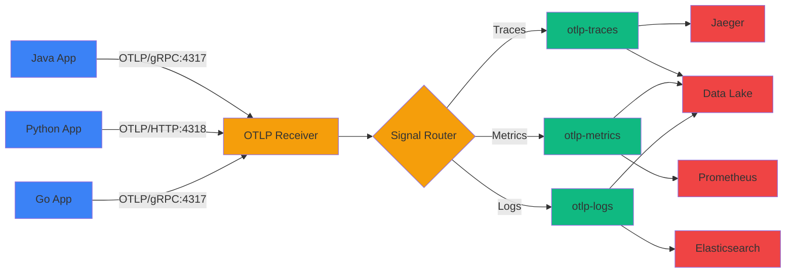

# Kafka Connect OpenTelemetry Source Connector

<div class="hero" markdown>

Receive OpenTelemetry Protocol (OTLP) telemetry data from any application and stream it directly into Apache Kafka with automatic signal type routing, dual protocol support, and comprehensive monitoring.

[Get Started](getting-started/index.md){ .md-button .md-button--primary }
[View on GitHub](https://github.com/conduktor/kafka-connect-opentelemetry){ .md-button }

</div>

## Features

### :material-router-network: Dual Protocol Support
Accept OTLP data via both **gRPC (port 4317)** and **HTTP (port 4318)** protocols simultaneously, supporting all OpenTelemetry SDK clients.

### :material-source-branch: Three Signal Types
Automatically route **traces**, **metrics**, and **logs** to separate Kafka topics for downstream processing and analysis.

### :material-code-json: Flexible Output Formats
Choose between **JSON** (human-readable) or **Protobuf** (base64-encoded binary) output formats to optimize for your use case.

### :material-gauge: JMX Metrics Monitoring
Built-in comprehensive metrics via JMX including message counts, queue utilization, drop rates, and per-signal statistics.

### :material-lightning-bolt: High Throughput
Configurable message queues with backpressure handling and sequence-based offset management for reliable delivery.

### :material-shield-check: Production Ready
Reliable offset-based delivery guarantees, graceful shutdown handling, and detailed operational runbooks.

## Quick Example

Stream telemetry from your OpenTelemetry-instrumented applications into Kafka:

=== "Connector Configuration"

    ```json
    {
      "name": "otlp-source-connector",
      "config": {
        "connector.class": "io.conduktor.connect.otel.OpenTelemetrySourceConnector",
        "tasks.max": "1",

        "otlp.grpc.enabled": "true",
        "otlp.grpc.port": "4317",
        "otlp.http.enabled": "true",
        "otlp.http.port": "4318",

        "kafka.topic.traces": "otlp-traces",
        "kafka.topic.metrics": "otlp-metrics",
        "kafka.topic.logs": "otlp-logs",

        "otlp.message.format": "json"
      }
    }
    ```

=== "Deploy Connector"

    ```bash
    curl -X POST http://localhost:8083/connectors \
      -H "Content-Type: application/json" \
      -d @otlp-connector.json
    ```

=== "Configure OTEL SDK"

    ```bash
    # Point your application to the connector
    export OTEL_EXPORTER_OTLP_ENDPOINT=http://localhost:4318
    export OTEL_EXPORTER_OTLP_PROTOCOL=http/protobuf
    export OTEL_SERVICE_NAME=my-application

    # Run your instrumented application
    java -javaagent:opentelemetry-javaagent.jar \
      -jar my-application.jar
    ```

=== "Consume Traces"

    ```bash
    kafka-console-consumer.sh \
      --bootstrap-server localhost:9092 \
      --topic otlp-traces \
      --from-beginning \
      --property print.key=true
    ```

## Use Cases

The connector is ideal for building observability pipelines with Kafka:

- **Observability Pipelines** - Ingest telemetry from microservices into Kafka for processing, enrichment, and routing
- **Log Aggregation** - Collect application logs via OTLP and stream to Kafka for centralized analysis
- **Trace Storage** - Store distributed traces in Kafka for replay, analysis, and long-term retention
- **Metrics Collection** - Aggregate application metrics into Kafka for real-time monitoring and alerting
- **Multi-Backend Routing** - Fan out telemetry to multiple observability backends (Jaeger, Prometheus, Elasticsearch)
- **Telemetry Buffering** - Use Kafka as a buffer between applications and observability backends for reliability

## Architecture



The connector acts as an **OTLP receiver endpoint** that applications send telemetry to. It automatically routes traces, metrics, and logs to separate Kafka topics, where downstream consumers can process and forward them to various observability backends.

## Why This Connector?

| Feature | Kafka Connect OTLP | OpenTelemetry Collector | Direct to Backend |
|---------|-------------------|------------------------|-------------------|
| Kafka-native | ✅ Built-in | ⚠️ Requires Kafka exporter | ❌ No Kafka support |
| Signal routing | ✅ Automatic | ⚠️ Manual config | ❌ Single backend |
| Deployment | ✅ Kafka Connect | ⚠️ Separate service | ✅ Simple |
| Monitoring | ✅ JMX/Prometheus | ✅ Built-in | ⚠️ Backend-specific |
| Buffering | ✅ Kafka topics | ⚠️ Memory only | ❌ No buffer |
| Multi-backend | ✅ Fan-out pattern | ✅ Processors | ❌ Single target |
| Maintenance | ✅ Integrated | ⚠️ DIY | ✅ Vendor-managed |

## Performance

- **Throughput**: Handles 10,000+ spans/metrics/logs per second on standard hardware
- **Latency**: < 10ms from OTLP receipt to Kafka produce
- **Reliability**: Sequence-based offset management prevents message loss
- **Scalability**: Configurable queue size for traffic bursts

## Comparison with OpenTelemetry Collector

### When to use this connector:

- You're already using Kafka as your data backbone
- You want to leverage Kafka's durability and replay capabilities
- You need to fan out telemetry to multiple consumers
- You want centralized observability data in Kafka topics
- You're building custom telemetry processing pipelines

### When to use OTEL Collector:

- You need advanced telemetry transformations
- You require direct exports to 50+ observability backends
- You don't need Kafka in your architecture
- You need sophisticated sampling and filtering

### Use both together:

Many production deployments use **both**:

1. Applications → OTLP Connector → Kafka topics
2. Kafka topics → OTEL Collector → Various backends

This provides Kafka's durability + Collector's flexibility.

## OpenTelemetry SDK Configuration Examples

### Java Application

```java
import io.opentelemetry.api.OpenTelemetry;
import io.opentelemetry.exporter.otlp.trace.OtlpGrpcSpanExporter;
import io.opentelemetry.sdk.OpenTelemetrySdk;
import io.opentelemetry.sdk.trace.SdkTracerProvider;
import io.opentelemetry.sdk.trace.export.BatchSpanProcessor;

// Configure OTLP exporter to send to connector
OtlpGrpcSpanExporter spanExporter = OtlpGrpcSpanExporter.builder()
    .setEndpoint("http://kafka-connect-host:4317")
    .build();

SdkTracerProvider tracerProvider = SdkTracerProvider.builder()
    .addSpanProcessor(BatchSpanProcessor.builder(spanExporter).build())
    .build();

OpenTelemetry openTelemetry = OpenTelemetrySdk.builder()
    .setTracerProvider(tracerProvider)
    .buildAndRegisterGlobal();
```

### Python Application

```python
from opentelemetry import trace
from opentelemetry.exporter.otlp.proto.grpc.trace_exporter import OTLPSpanExporter
from opentelemetry.sdk.trace import TracerProvider
from opentelemetry.sdk.trace.export import BatchSpanProcessor

# Configure OTLP exporter
trace.set_tracer_provider(TracerProvider())
tracer_provider = trace.get_tracer_provider()

otlp_exporter = OTLPSpanExporter(
    endpoint="http://kafka-connect-host:4317",
    insecure=True
)

tracer_provider.add_span_processor(BatchSpanProcessor(otlp_exporter))
```

### Go Application

```go
package main

import (
    "go.opentelemetry.io/otel"
    "go.opentelemetry.io/otel/exporters/otlp/otlptrace/otlptracegrpc"
    sdktrace "go.opentelemetry.io/otel/sdk/trace"
)

func main() {
    // Configure OTLP exporter
    exporter, _ := otlptracegrpc.New(
        context.Background(),
        otlptracegrpc.WithEndpoint("kafka-connect-host:4317"),
        otlptracegrpc.WithInsecure(),
    )

    tp := sdktrace.NewTracerProvider(
        sdktrace.WithBatcher(exporter),
    )

    otel.SetTracerProvider(tp)
}
```

### Environment Variables (All Languages)

```bash
# gRPC endpoint
export OTEL_EXPORTER_OTLP_ENDPOINT=http://kafka-connect-host:4317
export OTEL_EXPORTER_OTLP_PROTOCOL=grpc

# HTTP endpoint
export OTEL_EXPORTER_OTLP_ENDPOINT=http://kafka-connect-host:4318
export OTEL_EXPORTER_OTLP_PROTOCOL=http/protobuf

# Service identification
export OTEL_SERVICE_NAME=my-application
export OTEL_RESOURCE_ATTRIBUTES=environment=production,version=1.0.0
```

## Operational Features

Includes comprehensive operational tooling:

- **JMX Metrics**: Per-signal counters (received/dropped/produced), queue statistics, drop rates
- **Structured Logging**: Event-based logs for easy parsing and alerting
- **Graceful Shutdown**: Clean shutdown with in-flight message completion
- **Operational Runbook**: Detailed troubleshooting and recovery procedures
- **Health Checks**: JMX-based health monitoring examples

## Message Format Examples

### JSON Format (Default)

Human-readable format for debugging and downstream JSON processing:

```json
{
  "resourceSpans": [
    {
      "resource": {
        "attributes": [
          {
            "key": "service.name",
            "value": { "stringValue": "checkout-service" }
          },
          {
            "key": "service.version",
            "value": { "stringValue": "1.0.0" }
          }
        ]
      },
      "scopeSpans": [
        {
          "scope": {
            "name": "checkout-tracer"
          },
          "spans": [
            {
              "traceId": "5B8EFFF798038103D269B633813FC60C",
              "spanId": "EEE19B7EC3C1B174",
              "name": "process-payment",
              "kind": "SPAN_KIND_INTERNAL",
              "startTimeUnixNano": "1609459200000000000",
              "endTimeUnixNano": "1609459200500000000",
              "attributes": [
                {
                  "key": "payment.amount",
                  "value": { "doubleValue": 99.99 }
                }
              ]
            }
          ]
        }
      ]
    }
  ]
}
```

### Protobuf Format

Compact binary format (base64-encoded) for high-volume production:

```
CiYKFgoKc2VydmljZS5uYW1lEggSBmNoZWNrb3V0LXNlcnZpY2UKHgoTc2VydmljZS52ZXJzaW9u...
```

Decode downstream using OTLP protobuf definitions.

## Development & Testing

### Building from Source

```bash
git clone https://github.com/conduktor/kafka-connect-opentelemetry.git
cd kafka-connect-opentelemetry
mvn clean package
```

### Running Tests

```bash
# Unit tests
mvn test

# Integration tests (requires Docker)
mvn verify
```

The test suite includes:

- **Unit Tests**: Configuration validation, connector lifecycle, task management
- **Integration Tests**: OTLP receiver behavior, gRPC/HTTP protocol handling, TLS configuration
- **System Integration Tests** (`OtelConnectorSystemIT`): Full end-to-end testing with Testcontainers that spins up Kafka + Kafka Connect containers, sends OTLP telemetry via gRPC/HTTP, and verifies messages arrive in Kafka topics

## Community & Support

- **GitHub Issues**: [Report bugs and request features](https://github.com/conduktor/kafka-connect-opentelemetry/issues)
- **Slack Community**: [Join Conduktor Slack](https://conduktor.io/slack)
- **Documentation**: [Full reference guide](getting-started/index.md)

## License

Apache License 2.0 - see [LICENSE](https://github.com/conduktor/kafka-connect-opentelemetry/blob/main/LICENSE) for details.

---

<div class="cta-section" markdown>

## Ready to Get Started?

[Getting Started Guide](getting-started/index.md){ .md-button .md-button--primary }
[View on GitHub](https://github.com/conduktor/kafka-connect-opentelemetry){ .md-button }
[See FAQ](faq.md){ .md-button }

</div>
